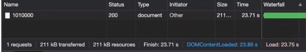
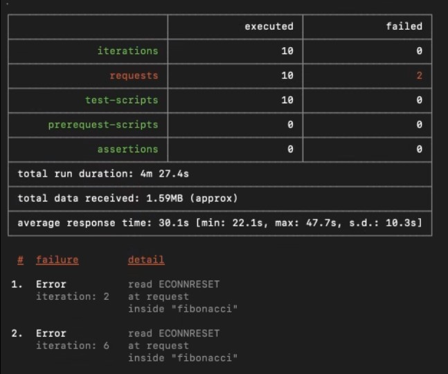

### Escuela Colombiana de Ingeniería
### Arquitecturas de Software - ARSW

## Escalamiento en Azure con Maquinas Virtuales, Sacale Sets y Service Plans

### Dependencias
* Cree una cuenta gratuita dentro de Azure. Para hacerlo puede guiarse de esta [documentación](https://azure.microsoft.com/en-us/free/search/?&ef_id=Cj0KCQiA2ITuBRDkARIsAMK9Q7MuvuTqIfK15LWfaM7bLL_QsBbC5XhJJezUbcfx-qAnfPjH568chTMaAkAsEALw_wcB:G:s&OCID=AID2000068_SEM_alOkB9ZE&MarinID=alOkB9ZE_368060503322_%2Bazure_b_c__79187603991_kwd-23159435208&lnkd=Google_Azure_Brand&dclid=CjgKEAiA2ITuBRDchty8lqPlzS4SJAC3x4k1mAxU7XNhWdOSESfffUnMNjLWcAIuikQnj3C4U8xRG_D_BwE). Al hacerlo usted contará con $200 USD para gastar durante 1 mes.

### Parte 0 - Entendiendo el escenario de calidad

Adjunto a este laboratorio usted podrá encontrar una aplicación totalmente desarrollada que tiene como objetivo calcular el enésimo valor de la secuencia de Fibonnaci.

**Escalabilidad**
Cuando un conjunto de usuarios consulta un enésimo número (superior a 1000000) de la secuencia de Fibonacci de forma concurrente y el sistema se encuentra bajo condiciones normales de operación, todas las peticiones deben ser respondidas y el consumo de CPU del sistema no puede superar el 70%.

### Parte 1 - Escalabilidad vertical

1. Diríjase a el [Portal de Azure](https://portal.azure.com/) y a continuación cree una maquina virtual con las características básicas descritas en la imágen 1 y que corresponden a las siguientes:
    * Resource Group = SCALABILITY_LAB
    * Virtual machine name = VERTICAL-SCALABILITY
    * Image = Ubuntu Server 
    * Size = Standard B1ls
    * Username = scalability_lab
    * SSH publi key = Su llave ssh publica


2. Para conectarse a la VM use el siguiente comando, donde las `x` las debe remplazar por la IP de su propia VM.

    `ssh scalability_lab@xxx.xxx.xxx.xxx`

3. Instale node, para ello siga la sección *Installing Node.js and npm using NVM* que encontrará en este [enlace](https://linuxize.com/post/how-to-install-node-js-on-ubuntu-18.04/).
4. Para instalar la aplicación adjunta al Laboratorio, suba la carpeta `FibonacciApp` a un repositorio al cual tenga acceso y ejecute estos comandos dentro de la VM:

    `git clone <your_repo>`

    `cd <your_repo>/FibonacciApp`

    `npm install`

5. Para ejecutar la aplicación puede usar el comando `npm FibinacciApp.js`, sin embargo una vez pierda la conexión ssh la aplicación dejará de funcionar. Para evitar ese compartamiento usaremos *forever*. Ejecute los siguientes comando dentro de la VM.

    `npm install forever -g`

    `forever start FibinacciApp.js`

6. Antes de verificar si el endpoint funciona, en Azure vaya a la sección de *Networking* y cree una *Inbound port rule* tal como se muestra en la imágen. Para verificar que la aplicación funciona, use un browser y user el endpoint `http://xxx.xxx.xxx.xxx:3000/fibonacci/6`. La respuesta debe ser `The answer is 8`.


7. La función que calcula en enésimo número de la secuencia de Fibonacci está muy mal construido y consume bastante CPU para obtener la respuesta. Usando la consola del Browser documente los tiempos de respuesta para dicho endpoint usando los siguintes valores:

   > Resultado con espacio normal:
   > * 1000000
   >
   > 
   >
   > * 1010000
   >
   > 
   >
   > * 1020000
   >
   > 
   >
   > * 1030000
   >
   > 
   >
   > * 1040000
   >
   > 
   >
   > * 1050000
   >
   > 
   >
   > * 1060000
   >
   > 
   >
   > * 1070000
   >
   > 
   >
   > * 1080000
   >
   > 
   >
   > * 1090000
   >
   > 

> Resultado con espacio agrandado:
> * 1000000
>
> 
>
> * 1010000
>
> 
>
> * 1020000
>
> 
>
> * 1030000
>
> 
>
> * 1040000
>
> 
>
> * 1050000
>
> 
>
> * 1060000
>
> 
>
> * 1070000
>
> 
>
> * 1080000
>
> 
>
> * 1090000
>
> 
 

8. Dírijase ahora a Azure y verifique el consumo de CPU para la VM. (Los resultados pueden tardar 5 minutos en aparecer).

    

   > Revisión con espacio normal:
   >
   > 

   > Revisión con espacio agrandado:
   >
   > 


9. Ahora usaremos Postman para simular una carga concurrente a nuestro sistema. Siga estos pasos.
    * Instale newman con el comando `npm install newman -g`. Para conocer más de Newman consulte el siguiente [enlace](https://learning.getpostman.com/docs/postman/collection-runs/command-line-integration-with-newman/).
    * Diríjase hasta la ruta `FibonacciApp/postman` en una maquina diferente a la VM.
    * Para el archivo `[ARSW_LOAD-BALANCING_AZURE].postman_environment.json` cambie el valor del parámetro `VM1` para que coincida con la IP de su VM.
    * Ejecute el siguiente comando.

    ```
    newman run ARSW_LOAD-BALANCING_AZURE.postman_collection.json -e [ARSW_LOAD-BALANCING_AZURE].postman_environment.json -n 10 &
    newman run ARSW_LOAD-BALANCING_AZURE.postman_collection.json -e [ARSW_LOAD-BALANCING_AZURE].postman_environment.json -n 10
    ```
    > Resultados con espacio normal:
    >
    > 
    > 
    > 
    > 
    > 
   
   > Resultados con espacio agrandado:
   >
   >                                                                                                                                                                                                                                                                                                                                                                                                                                                                                                                                                                                                                                                                                                                                                                                                                                                                                                                                                                                                                                                                                                                           
   > 
   > 
   > 

10. La cantidad de CPU consumida es bastante grande y un conjunto considerable de peticiones concurrentes pueden hacer fallar nuestro servicio. Para solucionarlo usaremos una estrategia de Escalamiento Vertical. En Azure diríjase a la sección *size* y a continuación seleccione el tamaño `B2ms`.

    

11. Una vez el cambio se vea reflejado, repita el paso 7, 8 y 9.
12. Evalue el escenario de calidad asociado al requerimiento no funcional de escalabilidad y concluya si usando este modelo de escalabilidad logramos cumplirlo.

    RTA//Se puede Considerar que no se cumple el requerimiento funcional debido que a pesar de haber hecho un escalamiento horizontal se siguen presentando errores al momento de realizar la ejecución con los scripts de postman.


13. Vuelva a dejar la VM en el tamaño inicial para evitar cobros adicionales.

**Preguntas**

1. ¿Cuántos y cuáles recursos crea Azure junto con la VM?

    > En este caso se crean cuatro recursos que son: Virtual Machine, Resource Group, Public and Private IP address.

2. ¿Brevemente describa para qué sirve cada recurso?

   > Virtual Machine: Es un software que simula a un computador real.
                                                        
                                                        
   > Resource Group: Es un contenedor que contiene recursos relacionados para una solución de Azure. El grupo de recursos incluye aquellos recursos que desea administrar como grupo. 
                                       
                                       
   > Public IP address: Las direcciones IP públicas permiten que los recursos de Internet se comuniquen de forma entrante a los recursos de Azure. Las direcciones IP públicas permiten que los recursos de Azure se comuniquen con Internet y con los servicios públicos de Azure.
   
   
   > IP privada: Permiten la comunicación entre recursos en Azure tales como:
   > * Virtual machine network interfaces
   > * Internal load balancers (ILBs)
   > * Application gateways
   > * Virtual network.
   > * Red local a través de una pasarela VPN o un circuito ExpressRoute.

3. ¿Al cerrar la conexión ssh con la VM, por qué se cae la aplicación que ejecutamos con el comando `npm FibonacciApp.js`? ¿Por qué debemos crear un *Inbound port rule* antes de acceder al servicio?

    > Si se cierra la conexión ssh también se terminaran los procesos que se esten ejecutando en esa conexión, por eso es necesario ejecutarlo con forever.
    > Porque por defecto solo esta abierto el puerto 22 por lo que las conexiones desde el resto de puertos no son aceptadas

4. Adjunte tabla de tiempos e interprete por qué la función tarda tando tiempo.
   
   > La función tarda tanto tiempo y tiende a ser incremental debido a la cantidad de iteraciones que se realizan sobre esta

5. Adjunte imágen del consumo de CPU de la VM e interprete por qué la función consume esa cantidad de CPU.

   > 
                                                                                                               
   > 
                                                                                                                                                                                                                                                                             
   > Consume tanta CPU debido a que se tiene una implementación no eficaz la cual usa demasiados recursos para realizar
   > muchas iteraciones.
                                                                                                               
                                                                                                                                                                                                                         
6. Adjunte la imagen del resumen de la ejecución de Postman. Interprete:
    * Tiempos de ejecución de cada petición.
    * Si hubo fallos documentelos y explique.
    
   > Sin aumento de espacio:
   
   > 
                                                                                                                                                                            
   > 
                                                                                                                                                                            
   > 
                                                                                                                                                                            
   > 
                                                                                                                                                                            
   > 
   
   > Se obtienen fallos de desconexión y los tiempos de ejecución varían entre 21s y 44s

   > Con aumento de espacio:
   
   >  
                                                                                                                                                                                                                                                                                                                                                                                                                                                                                                                                                                                                                                                                                                                                                                                                                                                                                                                                                                                                                                                                                                                                                                                                                                                                                                                                                                                                                                                                                                                                                                                                                                                       
   > 
                                                                                                                                                                                                                                                                                                                                                                                                                                                                                                                               
   > 
                                                                                                                                                                                                                                                                                                                                                                                                                                                                                                                               
   > 
   
   > Se siguen obteniendo fallos de desconexión aunque un poco menores y los tiempos disminuyen y varían entre 14s y 30s

7. ¿Cuál es la diferencia entre los tamaños `B2ms` y `B1ls` (no solo busque especificaciones de infraestructura)?
   > Se diferencian en su capacidad en memoria, uno con 0.5Gb y otro con 8Gb respectivamente, además de su gran diferencia en la CPU, ya que
   > B2ms es el doble de B1ls, esto ocasiona que el precio por mes del B2ms sea mucho mayor que el de B1ls, adicionalmente el rendimiento
   > que proporciona B2ms es mejor y mayor optimizado debido a las características técnicas que este posee.
   
   
   
8. ¿Aumentar el tamaño de la VM es una buena solución en este escenario?, ¿Qué pasa con la FibonacciApp cuando cambiamos el tamaño de la VM?

    > Se evidencio que el tiempo de respuesta disminuyo al aumentar la capacida, sin embargo los resultados obtenidos no mejoran drasticamente, por lo que la relación precio/beneficio no justifica el aumento de la capacidad. La aplicación sigue requiriendo una gran cantidad de procesamiento.

9. ¿Qué pasa con la infraestructura cuando cambia el tamaño de la VM? ¿Qué efectos negativos implica?

    > Al solicitar mas capacidad el precio aumenta drasticamente.

10. ¿Hubo mejora en el consumo de CPU o en los tiempos de respuesta? Si/No ¿Por qué?

    > En términos de porcentaje hubo mejora, ya que se redujo el consumo en casi un 40%, pero en términos proporcionales, la mejora fu casi nula.

11. Aumente la cantidad de ejecuciones paralelas del comando de postman a `4`. ¿El comportamiento del sistema es
    porcentualmente mejor?

    > No, debido a que se siguen presentando la misma cantidad de errores al momento de ejecutarlo.

### Parte 2 - Escalabilidad horizontal

#### Crear el Balanceador de Carga

Antes de continuar puede eliminar el grupo de recursos anterior para evitar gastos adicionales y realizar la actividad en un grupo de recursos totalmente limpio.

1. El Balanceador de Carga es un recurso fundamental para habilitar la escalabilidad horizontal de nuestro sistema, por eso en este paso cree un balanceador de carga dentro de Azure tal cual como se muestra en la imágen adjunta.


2. A continuación cree un *Backend Pool*, guiese con la siguiente imágen.


3. A continuación cree un *Health Probe*, guiese con la siguiente imágen.


4. A continuación cree un *Load Balancing Rule*, guiese con la siguiente imágen.


5. Cree una *Virtual Network* dentro del grupo de recursos, guiese con la siguiente imágen.


#### Crear las maquinas virtuales (Nodos)

Ahora vamos a crear 3 VMs (VM1, VM2 y VM3) con direcciones IP públicas standar en 3 diferentes zonas de disponibilidad. Después las agregaremos al balanceador de carga.

1. En la configuración básica de la VM guíese por la siguiente imágen. Es importante que se fije en la "Avaiability Zone", donde la VM1 será 1, la VM2 será 2 y la VM3 será 3.


2. En la configuración de networking, verifique que se ha seleccionado la *Virtual Network*  y la *Subnet* creadas anteriormente. Adicionalmente asigne una IP pública y no olvide habilitar la redundancia de zona.


3. Para el Network Security Group seleccione "avanzado" y realice la siguiente configuración. No olvide crear un *Inbound Rule*, en el cual habilite el tráfico por el puerto 3000. Cuando cree la VM2 y la VM3, no necesita volver a crear el *Network Security Group*, sino que puede seleccionar el anteriormente creado.


4. Ahora asignaremos esta VM a nuestro balanceador de carga, para ello siga la configuración de la siguiente imágen.


5. Finalmente debemos instalar la aplicación de Fibonacci en la VM. para ello puede ejecutar el conjunto de los siguientes comandos, cambiando el nombre de la VM por el correcto

```
git clone https://github.com/daprieto1/ARSW_LOAD-BALANCING_AZURE.git

curl -o- https://raw.githubusercontent.com/creationix/nvm/v0.34.0/install.sh | bash
source /home/vm1/.bashrc
nvm install node

cd ARSW_LOAD-BALANCING_AZURE/FibonacciApp
npm install

npm install forever -g
forever start FibonacciApp.js
```

Realice este proceso para las 3 VMs, por ahora lo haremos a mano una por una, sin embargo es importante que usted sepa que existen herramientas para aumatizar este proceso, entre ellas encontramos Azure Resource Manager, OsDisk Images, Terraform con Vagrant y Paker, Puppet, Ansible entre otras.

#### Probar el resultado final de nuestra infraestructura

1. Porsupuesto el endpoint de acceso a nuestro sistema será la IP pública del balanceador de carga, primero verifiquemos que los servicios básicos están funcionando, consuma los siguientes recursos:

```
http://52.155.223.248/
http://52.155.223.248/fibonacci/1
```

2. Realice las pruebas de carga con `newman` que se realizaron en la parte 1 y haga un informe comparativo donde contraste: tiempos de respuesta, cantidad de peticiones respondidas con éxito, costos de las 2 infraestrucruras, es decir, la que desarrollamos con balanceo de carga horizontal y la que se hizo con una maquina virtual escalada.

3. Agregue una 4 maquina virtual y realice las pruebas de newman, pero esta vez no lance 2 peticiones en paralelo, sino que incrementelo a 4. Haga un informe donde presente el comportamiento de la CPU de las 4 VM y explique porque la tasa de éxito de las peticiones aumento con este estilo de escalabilidad.

```
newman run ARSW_LOAD-BALANCING_AZURE.postman_collection.json -e [ARSW_LOAD-BALANCING_AZURE].postman_environment.json -n 10 &
newman run ARSW_LOAD-BALANCING_AZURE.postman_collection.json -e [ARSW_LOAD-BALANCING_AZURE].postman_environment.json -n 10 &
newman run ARSW_LOAD-BALANCING_AZURE.postman_collection.json -e [ARSW_LOAD-BALANCING_AZURE].postman_environment.json -n 10 &
newman run ARSW_LOAD-BALANCING_AZURE.postman_collection.json -e [ARSW_LOAD-BALANCING_AZURE].postman_environment.json -n 10
```

**Preguntas**


* ¿Cuáles son los tipos de balanceadores de carga en Azure y en qué se diferencian

  > Existen 2 tipos de balanceadores de carga en Azure, el balanceador público y el balanceador privado (interno), se
  > diferencian en que el balanceador público está hecho para dar conexiones de salida para las máquinas virtuales, mientras que
  > el interno se utilizan para realizar el equilibrio de la carga dentro de una red virtual.

* ¿Qué es SKU, qué tipos hay y en qué se diferencian?

  > Representa una posibilidad para comprar Existencias (SKU) por debajo de un producto. Estos representan las diferentes formas del producto.

* ¿Por qué el balanceador de carga necesita una IP pública?

  > Para añadir un punto de conexión a los perfiles Traffic Manager, además que este será el punto por el cual se accederá el Front-End

* ¿Cuál es el propósito del *Backend Pool*?

  > El pool de backend es un componente crítico del balanceador de carga. El pool de backend define el grupo de recursos que servirá el tráfico para una regla de equilibrio de carga determinada.

* ¿Cuál es el propósito del *Health Probe*?

  > Permitir que el, Load Balancer detecte el estado del extremo del backend. La configuración de la sonda de estado y las respuestas de la sonda determinan qué instancias del backend pool recibirán nuevos flujos.

* ¿Cuál es el propósito de la *Load Balancing Rule*? ¿Qué tipos de sesión persistente existen, por qué esto es
  importante y cómo puede afectar la escalabilidad del sistema?.

  > Definir el tráfico de red atreves de las máquinas virtuales, las sesiones que este permite son sesiones sin definir
  > persistencia o con persistencia definida, esto significa que cuando se realice una misma petition esta será redirigida
  > al cliente original y no a uno nuevo, esto puede afectar a aplicaciones que trabajen con sesiones guardadas en memoria,
  > o en aplicaciones sticky.

* ¿Qué es una *Virtual Network*?

  > Es el bloque de creación fundamental de una red privada en Azure. VNet permite muchos tipos de recursos de Azure,
  > como Azure Virtual Machines (máquinas virtuales), para comunicarse de forma segura entre usuarios, con Internet y
  > con las redes locales.

* ¿Qué es una *Subnet*?

  > Es un rango de direcciones lógicas, que se utiliza normalmente cuando se tienen redes demasiado grandes, estos son divididas en redes más pequeñas; estas se conocen como subnets

* ¿Para qué sirven los *address space* y *address range*?

  > Los address space son aquellas direcciones de red asignables dentro de una Vnt y los address range son las redes asignables dentro de una subnet.

* ¿Qué son las *Availability Zone* y por qué seleccionamos 3 diferentes zonas?. ¿Qué significa que una IP sea *
  zone-redundant*?

  > Una zona de disponibilidad es una oferta de alta disponibilidad que protege sus aplicaciones y datos de los fallos
  > del centro de datos. Las zonas de disponibilidad son ubicaciones físicas únicas dentro de una región de Azure.

  > Cuando una IP es zone-redundant es aquella que replica las peticiones y los datos por medio de las Availability Zone.

* ¿Cuál es el propósito del *Network Security Group*?

  > Puede utilizar un grupo de seguridad de red de Azure para filtrar el tráfico de red hacia y desde los recursos de Azure
  > en una red virtual de Azure. Un grupo de seguridad de red contiene reglas de seguridad que permiten o deniegan el tráfico
  > de red entrante hacia, o el tráfico de red saliente desde, varios tipos de recursos de Azure. Para cada regla, puede
  > especificar el origen y el destino, el puerto y el protocolo.
  
* Informe de newman 1 (Punto 2)
   > Se puede observar que en el newman se obtienen menos errores que en la parte 1 ya que tenemos mas "capacidad" de procesamiento, adicional a esto tenemos la opción de distribuir el procesamiento en las 4 vm, en la parte 1 no era posible distribuir el procesamiento, en esta parte solo era posible aumentar la capacidad, por lo que se puede ver una mejora en este tipo de prueba.

   > 
                                                                                                                                                                                                                                                                                                                                                                                                                                  
   > 
                                                                                                                                                                                                                                                                                                                                                                                                                                                                                                                                                                                                                                                                                                                                                                                                                                                                                                             
   > 
                                                                                                                                                                                                                                                                                                                                                                                                                                                                                                                                                                                                                                                                                                                                                                                                                                                                                                                                                                                                                                                                                                                                                                                                                                                                                                                                                                                                                                                                                                                                                                                                                                                                                                                                                                                                                                                                   
   > 


* Presente el Diagrama de Despliegue de la solución.

   > 


